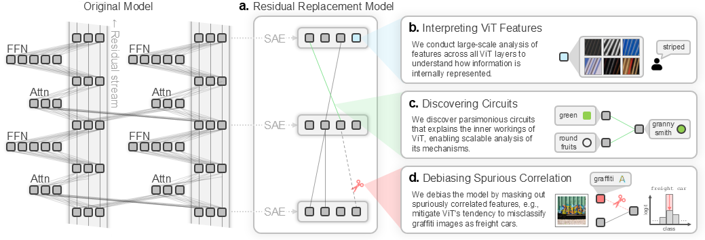

# [NeurIPS '25] Interpreting vision transformers via residual replacement model


<div align="center">

[](https://arxiv.org/abs/2509.17401)&nbsp;
[](LICENSE)



<b>[Jinyeong Kim](https://rubato-yeong.github.io/)<sup>&#42;</sup> &nbsp;&middot;&nbsp; [Junhyeok Kim](https://timesplutic.github.io)<sup>&#42;</sup><br></b>
[Yumin Shim](https://scholar.google.com/citations?user=DZhr9KMAAAAJ&hl=en) &nbsp;&middot;&nbsp; [Joohyeok Kim](https://kyyle2114.github.io/) &nbsp;&middot;&nbsp; [Sunyoung Jung](https://sunyj-hxppy.github.io/) &nbsp;&middot;&nbsp; [Seong Jae Hwang](https://micv.yonsei.ac.kr/seongjae)<sup>&dagger;</sup>

Yonsei University
(<sup>&#42;</sup>Equal contribution, <sup>&dagger;</sup>Corresponding author)

</div>

## Code

### 0. Environment Setup

```
conda env create -n RRM python=3.11
conda activate RRM
pip install -r requirements.txt
```

### 1. Extract Activations
In order to train sparse autoencoders (SAEs) on the residual stream, you first need to extract and record the intermediate states (activations) of the residual stream. This initial step involves running specific vision models on the target dataset. We use ViT, Dinov2, and CLIP for the vision model and Imagenet (ILSVRC2012) train set for the dataset.

To proceed, please open the script `1_extract_activations.py`, and configure the path arguments within the `parse_args()` function (Plase refer to the example paths provided as comments in the code for guidance.). Once your paths are configured, run the code from your terminal, specifying the model you wish to target, like so:
```
python 1_extract_activations.py --model vit
```

### 2. Train Sparse Autoencoders
Now that you have extracted the activations, you are ready to train the Sparse Autoencoders (SAEs). Open the script `2_train_TopKSAE.py` and configure the path arguments. If you plan to utilize Weights & Biases (WandB) for logging, please ensure you set the following global variables within the script:
- `YOUR_WANDB_API_KEY`
- `YOUR_WANDB_ENTITY_NAME`
- `YOUR_WANDB_PPROJECT_NAME`

Next, define the SAE configurations using the following parameters: `dict_size_R`, `top_k`, `model_layer`, and `model_type`.


| Parameter | Description |
|------|------|
| `dict_size_R` | The expansion factor for the dictionary size relative to the model dimension. A value of 1 means the dictionary size equals the model dimension; 2 means the size is doubled. |
| `top_k` | The number of top-k activations you wish to target for the sparse autoencoder. |
| `model_layer` | The specific layer number of the vision model whose activations are being used. |
| `model_type` | The type of vision model being used. |
  
You can set multiple values for `dic_size_R` and `top_k`. will automatically train multiple SAEs simultaneously, covering all combinations of the provided parameters. However, we recommend setting multiple values for **either** `dict_size_R` **or** `top_k`.

Run the following command in your terminal to begin training the SAEs:
```
python 2_train_TopKSAE.py --dict_size_R 0.5 1 2 --top_k 4 --model_layer 1 --model_type vit
```

### 3. Extract Qualitative Results
By extracting the qualitative results of your trained SAEs, you can finally begin to interpret and understand each individual feature learned by the SAE. Before running the script, two configuration steps are required:

1. **Script Arguments**: Configure the necessary path arguments within the script `3_extract_qualitative.py`.

1. **SAE Configurations**: Modify the default SAE arguments within the `load_default_sae_configs()` function, located in `utils/functions/load_models.py`, to match the parameters of your trained SAE.

Once configurations are complete, run the following command to extract the results:
```
python 3_extract_qualitative.py --model vit --target sae
```

### 4. Extract Average Activations
Before proceeding with circuit visualization, you need to extract the average activations of the model (Please refer to our paper!). Open the script `4_get_avg_activation.py` and configure the path arguments appropriately. Then run the file using the following command:
```
python 4_get_avg_activation.py --model vit
```

### 5. Circuit Visualize
Finally, you are ready to visualize the circuits! First, set the necessary path arguments in `5_visualize_circuit.py`. Crucially, ensure the `mean_acts_path` argument points to the activation file generated in the preceding Step 4.
To visualze the image with dataset index $i$, run the code as below:
```
python 5_visualize_circuit.py --data_index {{i}}
```

## Pretrained Weights

Our pretrained SAE checkpoints can be downloaded from the repository below.
- ViT: https://huggingface.co/timespt/topksae-vit-base-patch16-224
- Dinov2: https://huggingface.co/timespt/topksae-dinov2-vitb14-reg-lc
- CLIP-ViT: https://huggingface.co/timespt/topksae-clip-vit-base-patch16


## Citation

```
@misc{kim2025interpretingvisiontransformersresidual,
      title={Interpreting vision transformers via residual replacement model}, 
      author={Jinyeong Kim and Junhyeok Kim and Yumin Shim and Joohyeok Kim and Sunyoung Jung and Seong Jae Hwang},
      year={2025},
      eprint={2509.17401},
      archivePrefix={arXiv},
      primaryClass={cs.CV},
      url={https://arxiv.org/abs/2509.17401}, 
}
```
